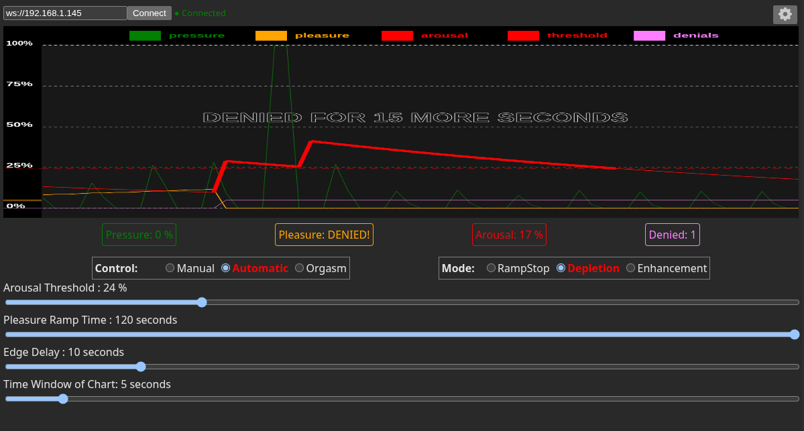
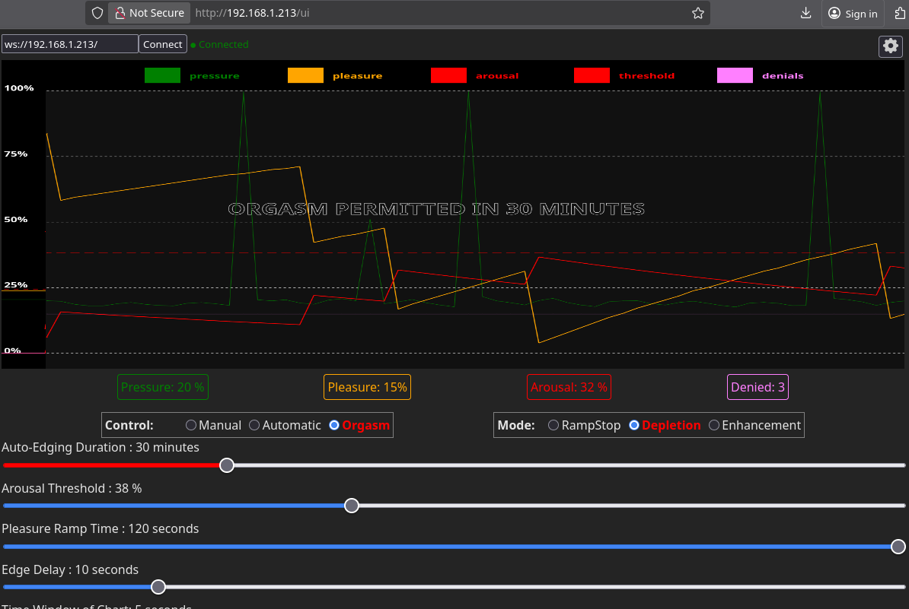

# Endless Orgasm Machine - An Automated Orgasm Denial Device for ESP32

### It knows...
What will surprise you most is how accurate it is that you only have a few moments left.  In this day and age algorithms are a respected part of our lives...this one knows you better than yourself.

Have you ever cut-off a sneeze before it happened and found it a conflicting blend of sensations?  Have you ever stopped going before your orgasm so you could last a bit longer?  If you're not afraid to use a buttplug and you're ready for an amazing experience this is for you.  

It is not a sex-toy in the traditional sense because it doesn't provide pleasure unless you add in a vibrator or connect it wirelessly to other toys.  They provide the pleasure, EOM tells them when to stop and when they can start again.

### The science!
Using an inflatable butt plug to detect pressure changes indicative of pelvic floor contractions, this software, and associated hardware, is used to detect when the user is approaching orgasm and control stimulation accordingly. The net result: automated edging and orgasm denial or enhancement.

### But I like orgasms...

Having to wait for it while being right at the edge makes it more intense!  Trying to resist getting close is a turn-on for some.  When you're ready to end the edging you can use "Control: Orgasm" to allow you to finish after a chosen number of minutes... or simply set it to "Control: Manual" and leave it running.  It can also be used after orgasms to determine exactly when the refractory period has subsided enough to begin the next round of pleasuring. 



## Building 
- Install [VSCode](https://code.visualstudio.com/) with the [PlatformIO](https://platformio.org/) extension
- Open this repo and let all the PlatformIO dependencies download
- Configure your wifi ssid and password at the top of [data/config.json](data/config.json) or skip this step to let it broadcast its own access point: ```EOM```.  You can have it both ways: Set it up to connect to your home wifi but if you're away EOM will go into access point mode after it fails to find it.
- Under ```PlatformIO -> Project Tasks -> esp32dev -> Platform``` choose ```Build Filesystem Image``` then ```Upload Filesystem Image```
- Under ```PlatformIO -> Project Tasks -> esp32dev -> General``` choose ```Build``` then eventually ```Upload and Monitor```
- Watch for your device's IP address to be displayed in the monitor window 
(In access point mode it is 192.168.4.1)

## Web UI

[The UI](eomui/README.md) is posted at https://lamystere.github.io/endless-orgasm-machine/eomui/public and can be installed on your Android or PC for offline use. 

[The UI](eomui/README.md) is also on the ESP32 itself and can be found by visiting the ```/ui``` endpoint at the IP address of your device.  You can watch the serial output to determine the IP.

Example: If you join the EOM WiFi access point the IP will be: ```192.168.4.1``` you should visit ```http://192.168.4.1/ui```  It will automatically open a connection to the websocket endpoint at ```http://192.168.4.1/```.




## bluetooth usage
WiFi is NOT necessary anymore!  The UI can work through bluetooth now! No ip address, wifi setup, or anything else needed.  Just connect to your EOM directly by clicking the bluetooth icon.  Android or PC Chrome only! Sorry Apple and Firefox enthusiasts but those two have deemed web bluetooth an unacceptable risk and it will never be available.

So how do you get that running? It is now configured as a PWA!  This means you can pull it up once from https://lamystere.github.io/endless-orgasm-machine/eomui/public and install it as an app.  It does not require an internet connection to work after installation...its just there in app mode ready to go.  I'll probably end up splitting the UI into an embedded version and an app version.  


Using Xtoys you can connect to the EOM and let it control your other Xtoys devices.  For Xtoys it emulates a device called [MonsterPub Mr. Devil Kegel](https://monsterpub.com/products/mp2-u-shaped-remote-egg-with-kegel).  The "pressure" reading corresponds to the "pleasure" output of the EOM.  The sliders for vibrator strength will work in manual mode.

<sub>Why Mr Devil?  Because it's one of the few bluetooth devices in Xtoys that has 2 way communication and high resolution (16 bit).  If you wish to connect Xtoys to the EOM over wifi you can choose the Edge-o-matic 3000 and it is backwards compatible.  This is less useful because Xtoys only chose to implement "arousal" and "pressure" inputs, so all the logic that goes into calculating the amount of pleasure is ignored.  </sub>


### Pleasure Modes:

|ID|Name|Description|
|---|---|---|
|1|Ramp-Stop|Pleasure ramps up, stopping abruptly on arousal threshold crossing.|
|2|Depletion (default)|Pleasure ramps up, but is reduced for even small arousal spikes.  This makes for a constant interaction with your arousal rather than just a sudden cutoff when it's over the limit|
|3|Enhancement|This is the opposite of edging, it will make you orgasm faster.  Pleasure ramps up as arousal increases, holding a peak for ramp_time.|

## Hardware

[Build Examples](doc/building/building.md)

This can be tested on almost any ESP32 device without any extra hardware by touching the pressure sensor pin.  This will simulate a pressure sensor being squeezed.  To actually play with it you will need to attach a pressure sensor and plug.  The [MPX5100DP](https://www.digikey.com/en/products/detail/nxp-usa-inc/MPX5100DP/464060) is the sensor it was designed around but anything capable of 15psi or greater should work whether analog or SPI.  Plug the port of the pressure sensor into the air hose for the butt plug.  

To get it to resemble [the original Nogasm device](https://github.com/nogasm/nogasm) you can then add a [12v power supply](https://www.amazon.com/ACEIRMC-Battery-Plastic-Storage-Connect/dp/B0986RMKBJ) and [charger](https://www.amazon.com/Battery-Charger-Lithium-Display-RC123A/dp/B0CRKSFTK9), a [simple transistor](https://www.amazon.com/ALLECIN-IRF4905-Transistors-IRF4905PBF-Transistor/dp/B0CBKGJT9N) or more protected [motor controller](https://www.amazon.com/High-Power-Adjustment-Electronic-Controller-Brightness/dp/B0DZP1NCVW), a [flyback diode](https://www.amazon.com/15SQ045-Diodes-Schottky-Blocking-Silicon/dp/B0D4F2WVS5), and [vibrator motor](https://www.amazon.com/RPTCOTU-R555-Vibration-Motor-Electrodynamic/dp/B0CSYWK5KQ).  You could share that power supply to the esp32 [through a buck converter](https://www.amazon.com/Regulator-Reducer-Converter-Aircraft-MP1584EN/dp/B0B779ZYN1) to make the whole thing wireless.  That's it.  You can set this all up to attach to the buttplug rather than having a wires and tubes leading to a control box, but its a matter of opinion which way is better.  

Tested boards: ESP32DEV, ESP32-WROOM32, ESP32-C6 (no motor out), ESP32-S3 

## WebSocket API

Documentation for the WebSocket API can be found in [doc/WebSocket.md](doc/WebSocket.md).


## Wait, isn't this the Edge-o-Matic 3000?

This is a fork of that project with a different set of goals.  The main goal is to make the project accessible to the maker community by keeping the hardware and software simple and DIY friendly - like [the original Nogasm](https://github.com/nogasm/nogasm) that started it all was.  The Edge-o-Matic code is designed around selling well-made but proprietary hardware and is [locked into it through closed-source code](https://github.com/MausTec/eom-hal-dist), crippling attempts to use it with DIY hardware.  It also included a lot of code to connect to related products and services.

This project was first vastly simplified then expanded with compatibility in mind.  You can try it using almost any modern ESP32 device with no additional customization.  You will need to connect a pressure sensor and inflatable buttplug to make it functional, but that's it.  It's meant to be operated wirelessly rather than through the additional hardware of a screen, knob, LEDs, network jack, etc.


### Customization suggestions 
- You can use [Xtoys.app](https://xtoys.app) as a control panel to ramp up any number of vibrators, strokers, or e-stim units in sync with the EOM over bluetooth.  See [this Xtoys layout for an example](https://xtoys.app/layouts/-OcwSDDWBei-Bg4xwe5o)
- If you want to connect Xtoys via wifi you will need to enable SSL in ```data/config.json``` and use the edge-o-matic Xtoys device.  The bluetooth connection is more useful since it sends pleasure level rather than arousal but there are some existing xtoys scripts that work with the edge-o-matic arousal level.
- You can use an inexpensive [Vibrating inflatable buttplug](https://www.amazon.com/Lovehoney-Black-Inflatable-Vibrating-Back/dp/B092VVXM63) and remove its control box to wire it directly to the EOM with a power circuit.  A [non-vibrating plug](https://www.amazon.com/Inflatable-Expandable-Stimulator-Beginners-Detachable/dp/B0DSPKVPM1) is even less expensive if you'll be controlling your pleasure wirelessly.
- If an [MPXV5100GP](https://octopart.com/search?q=MPXV5100GP&currency=USD) pressure sensor is too inconvenient or expensive to source you could use an easy to find [generic car exhaust pressure sensor](https://www.amazon.com/dp/B0997VKYQ9) since they are almost all analog 15psi 5v sensors.  The pin with the notch is Vin, middle is ground, third is Vout. Everything tested was 3V compatible.
- If you use an ESP32 board with an integrated screen ([Example 1](https://www.amazon.com/ideaspark-Development-Integrated-Wireless-Micropython), [Example 2](https://www.amazon.com/Waveshare-Development-Frequency-Single-Core-Processor/dp/B0DHTMYTCY)) you can enable the screen in [include/config.h](include/config.h) to see the IP of the device.
- As an alternative to a vibrating buttplug you can use [a plug made for enema play](https://www.amazon.com/Inflatable-Congestion-Cleaning-Expansion-Beginner/dp/B0CZRLPLQC) and pass a wire through the middle to an e-stim electrode or [to a vibrator on top](https://www.amazon.com/dp/B0024XI1LG).
- Someone posted a build that used tubing wrapped around a 3d printed shaft that also housed the electronics.  It was a neat new twist to the inflatable plug since the tubing reacted to pressure just like an inflatable.  The link is lost to time but it was on github somewhere.
- You could put in a higher range pressure sensor if you prefer to inflate the plug to more intense levels.  The measurement is of change in pressure, not overall pressure.
- You could order a [prebuilt PCB like is used for the Nogasm-esp32](https://github.com/Mathew3000/nogasm-esp32) 
- There really are a ridiculous number of implementations of the nogasm concept from the last decade...you should do some nogasm googling.


### To-do priority
- ability to connect directly to Lovense vibes, etc. from GUI
- do canvas drawing to offscreen element for efficiency
- audio buzzer for cooldown!
- add a config save button so setting changes aren't immediately permanent
- finish integrated screen support / ip display
- Is pressure multiplier working as intended?
- add build walkthrough to docs and more examples, pinouts and schematics
- ui and websockets using same endpoint if possible
- add X axis on chart (seconds)
- chart glitch on left side at startup
- make motor pin selection more intuitive
- Put some effort into UI styling
- disable internal motor control option?
- LED and encoder options? (Blink until connected)
- Implement patterns?  That's a biggie
- Running average math seems off

### Notable differences from Edge-o-matic
- Not tied to specific hardware!
- Runs over bluetooth
- Orgasm mode available over UI! (denies orgasms until timer runs out)
- UI hosted as PWA and on device... and is phone friendly
- communicates with Xtoys via BLE
- defaults to endless orgasm denial in ramp-stop mode
- smaller build size
- SD card requirement removed
- menu system removed
- console system removed
- action manager system removed
- hardwire networked device support removed 
- edge times are in seconds
