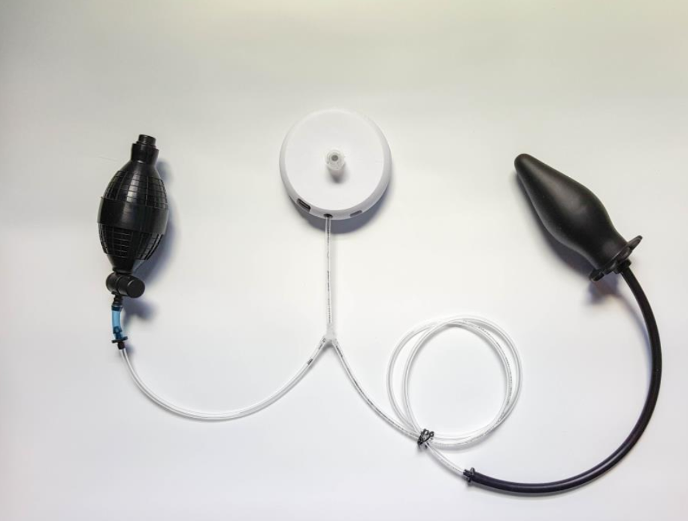
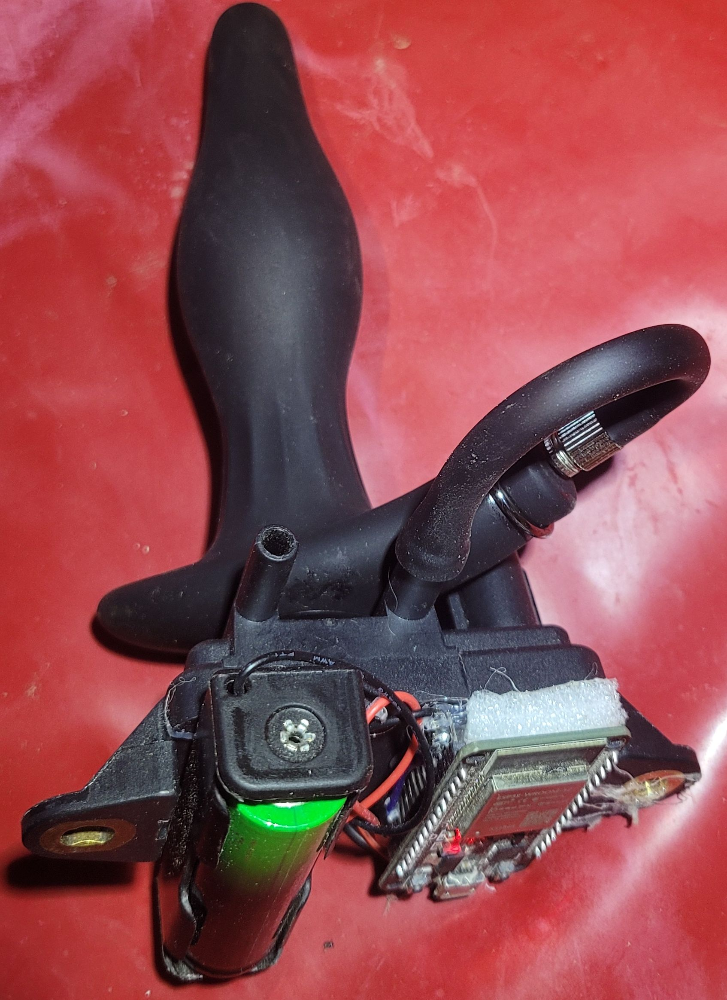

# Building an EOM

Todo: build walkthroughs

# Example builds:

### Custom PCB (~$150): [Mathew3000/nogasm-esp32](https://github.com/Mathew3000/nogasm-esp32) 
PCB can be ordered online using the files in the repo.  About $150
 

### Tiny DIY build (WIP)
- $7 [ESP32-S3 mini](https://www.amazon.com/dp/B0CR2RH7PS)
- $20 [MPXV5100GP pressure sensor](https://www.digikey.com/en/products/detail/nxp-usa-inc/MPXV5100GP/2186552)
- $15 [inflatable butt plug](https://www.amazon.com/Inflatable-Expandable-Stimulator-Beginners-Detachable/dp/B0DSPKVPM1)
- $20 [battery, charger, and connectors](https://www.amazon.com/dp/B08XZM3NG3)
- 3D printed case (wip)

### Small DIY with all the features (WIP)
- $20 [ESP32-C6 with integrated screen](https://www.amazon.com/dp/B0DHTMYTCY)
- $25 [MPX5100GP pressure sensor](https://www.digikey.com/en/products/detail/nxp-usa-inc/MPX5100GP/464061) (or use the smaller MPXV5100GP if you like)
- $20 [Enema inflatable buttplug](https://www.amazon.com/Inflatable-Congestion-Cleaning-Expansion-Beginner/dp/B0CZRLPLQC)
- An egg electrode (this will connect to your e-stim unit after passing through the plug, not the EOM)
- A small vibrator to fit inside the enema plug
- A transistor to control the vibe with
- A flyback diode to protect the circuit from the motor
- $20 [battery, charger, and connectors](https://www.amazon.com/dp/B08XZM3NG3)
- 3D printed case

### Cheapest possible (~$40 and its usable, but more likely just for testing):
- $15 [inflatable butt plug](https://www.amazon.com/Inflatable-Expandable-Stimulator-Beginners-Detachable/dp/B0DSPKVPM1)
- $12 [generic car exhaust pressure sensor](https://www.amazon.com/dp/B0997VKYQ9)
- $5 [ESP32](https://www.amazon.com/dp/B0F1MS5S8R)
- $7 [18650 cell](https://www.amazon.com/CWUU-9900mAh-Rechargeable-Flashlights-Headlamps/dp/B0D12P7L29)
- $1 [battery holder](https://www.amazon.com/DIANN-10pcs-Battery-Holder-Single/dp/B0BJV7SK5D)
- hot glue and rubber bands, or just use the full length of the tube and let it rest somewhere

